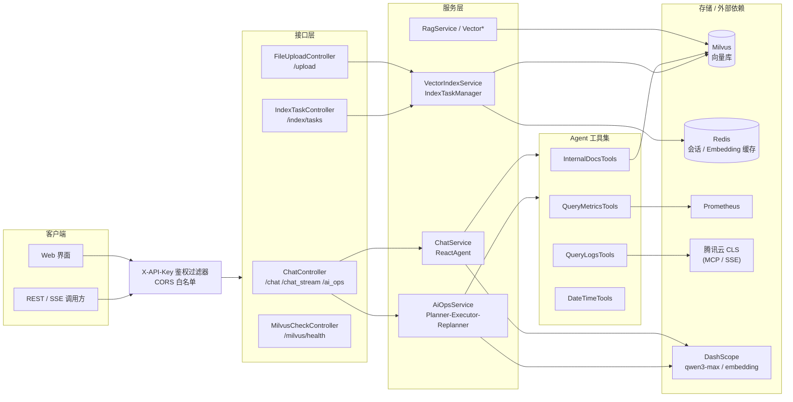

# SuperBizAgent

> 基于 Spring Boot + Spring AI 的智能问答与 AIOps 智能运维系统

[](https://openjdk.org/)
[](https://spring.io/projects/spring-boot)
[](LICENSE)

SuperBizAgent 是一个企业级智能业务代理系统，围绕两大核心能力构建：

- **RAG 智能问答**：基于 Milvus 向量检索 + 阿里云 DashScope 通义千问，提供检索增强生成、多轮对话与 SSE 流式输出。
- **AIOps 智能运维**：基于 Spring AI Agent（Planner-Executor-Replanner）多 Agent 协作，自动完成告警分析、日志查询、智能诊断与报告生成。

---

## 目录

- [核心特性](#核心特性)
- [系统架构](#系统架构)
- [技术栈](#技术栈)
- [项目结构](#项目结构)
- [快速开始](#快速开始)
- [API 接口](#api-接口)
- [配置说明](#配置说明)
- [测试与 CI](#测试与-ci)
- [安全设计](#安全设计)
- [许可证](#许可证)

---

## 核心特性

- **RAG 问答**：向量检索 + 文档分片 + 多轮上下文 + SSE 流式输出。
- **AIOps 运维**：多 Agent 协作，自动拉取 Prometheus 告警、检索云日志（CLS / MCP）、结合知识库生成诊断报告。
- **Agent 工具集**：文档检索、告警查询、日志查询、时间工具，可自动触发调用。
- **会话治理**：Redis / 内存双后端、LRU 淘汰、TTL 过期清理、上下文窗口维护。
- **工程化加固**：统一响应体、全局异常处理、TraceId 链路、X-API-Key 鉴权、CORS 白名单、启动配置校验。
- **性能与稳定性**：Embedding 结果缓存、批量向量化与批量写入、有界 SSE 线程池、Resilience4j 限流/超时/重试。
- **可观测性**：Spring Boot Actuator + Micrometer + Prometheus 指标暴露。
- **异步索引**：文件上传与目录重建均通过异步任务执行，返回 `taskId` 可查询进度。
- **Web 界面**：内置测试界面（Markdown 渲染 + 代码高亮），开箱可用。

---

## 系统架构



---

## 技术栈

| 技术 | 版本 | 说明 |
|------|------|------|
| Java | 17 | 开发语言 |
| Spring Boot | 3.2.12 | 应用框架 |
| Spring AI / Spring AI Alibaba | 1.1.0 / 1.1.0.0-RC2 | AI Agent 与 DashScope 集成 |
| DashScope SDK | 2.17.0 | 通义千问对话 + 文本向量化（`text-embedding-v4`）|
| Milvus | 2.5.10（SDK 2.6.10）| 向量数据库 |
| Redis | 7 | 会话存储 + Embedding 缓存 |
| Resilience4j | 2.2.0 | 限流 / 超时 / 重试 |
| Micrometer + Prometheus | - | 可观测性指标 |
| Spring AI MCP Client (WebFlux) | - | 接入腾讯云 CLS 日志服务 |
| Maven / JaCoCo | - | 构建与测试覆盖率门禁 |

---

## 项目结构

```
SuperBizAgent/
├── src/main/java/org/example/
│   ├── controller/                 # 接口层
│   │   ├── ChatController.java         # 对话 / 流式 / AIOps / 会话
│   │   ├── FileUploadController.java   # 文件上传（异步索引）
│   │   ├── IndexTaskController.java    # 索引任务管理
│   │   └── MilvusCheckController.java  # Milvus 健康检查
│   ├── service/                    # 服务层
│   │   ├── ChatService.java            # ReactAgent 对话编排
│   │   ├── AiOpsService.java           # AIOps 多 Agent 编排
│   │   ├── RagService.java             # RAG 检索增强
│   │   └── Vector*.java                # 向量化 / 索引 / 检索 / 迁移
│   ├── agent/tool/                 # Agent 工具集
│   │   ├── DateTimeTools.java          # 时间工具
│   │   ├── InternalDocsTools.java      # 文档检索
│   │   ├── QueryMetricsTools.java      # 告警查询（Prometheus）
│   │   └── QueryLogsTools.java         # 日志查询（CLS / MCP）
│   ├── common/                     # 通用组件
│   │   ├── session/                    # SessionStore（Redis / 内存 / 降级）
│   │   ├── cache/                      # EmbeddingCache
│   │   ├── ApiResponse / ErrorCode / BizException / GlobalExceptionHandler
│   │   └── TraceIdFilter               # 链路追踪
│   ├── config/                     # 配置（鉴权、CORS、Milvus、DashScope、线程池…）
│   ├── repository/                 # VectorRepository
│   ├── task/                       # IndexTaskManager（异步索引）
│   └── util/                       # FilenameSanitizer 等
├── src/main/resources/
│   ├── static/                     # Web 测试界面
│   ├── application.yml             # 运行配置（敏感值走环境变量）
│   └── application.yml.example     # 配置模板（含环境变量清单）
├── src/test/java/                  # Mockito 离线单元测试
├── aiops-docs/                     # 运维知识库文档
├── scripts/ci.sh                   # CI 门禁脚本
├── docs/plans/                     # 分阶段演进计划（P0~P3）
├── Dockerfile                      # 多阶段构建，非 root 运行
├── docker-compose.yml              # 全栈编排（app+redis+milvus+etcd+minio+attu）
├── vector-database.yml             # 仅向量库编排（本地开发用）
└── Makefile                        # 初始化 / 启停 / 上传 / CI 命令
```

---

## 快速开始

### 环境要求

- **JDK 17**、**Maven 3.8+**
- **Docker + Docker Compose**（运行 Milvus / Redis）
- 阿里云 **DashScope API Key**（[获取地址](https://bailian.console.aliyun.com/)）
- （可选）腾讯云 CLS MCP 端点，用于真实日志查询

### 环境变量

应用启动前需注入以下环境变量。**标记为“必填”的变量缺失时应用会启动失败（fail-fast）**，敏感值一律通过环境变量注入，切勿写入配置文件。

| 环境变量 | 必填 | 默认值 | 说明 |
|----------|------|--------|------|
| `DASHSCOPE_API_KEY` | ✅ | - | DashScope LLM + Embedding 共用密钥 |
| `APP_API_KEY` | ✅ | - | 本服务对外 API Key（`X-API-Key` 请求头）|
| `MCP_TENCENT_CLS_SSE_ENDPOINT` | ✅ | - | 腾讯云 CLS MCP SSE 端点（路径含凭证）|
| `APP_ALLOWED_ORIGINS` | ❌ | 空 | CORS 白名单，逗号分隔来源；空 = 拒绝跨域，严禁设为 `*` |
| `REDIS_HOST` / `REDIS_PORT` | ❌ | `localhost` / `6379` | Redis 地址 |
| `REDIS_PASSWORD` | ❌ | 空 | Redis 密码（Compose 部署时必填）|
| `MILVUS_COLLECTION_NAME` | ❌ | `biz` | Milvus 集合名称 |
| `FILE_UPLOAD_PATH` | ❌ | `./uploads` | 上传文件存储路径 |
| `SESSION_STORE` | ❌ | `redis` | 会话后端：`redis` 或 `memory`（演示）|

完整清单与密钥轮换指引见 [`application.yml.example`](src/main/resources/application.yml.example)。

### 方式一：Docker Compose 全栈部署（推荐）

一键拉起应用 + Redis + Milvus（含 etcd / MinIO / Attu 管理台）：

```bash
# 1. 准备环境变量（也可写入 .env 供 Compose 读取）
export DASHSCOPE_API_KEY=your-dashscope-key
export APP_API_KEY=your-app-api-key
export REDIS_PASSWORD=your-redis-password
export MCP_TENCENT_CLS_SSE_ENDPOINT=your-mcp-endpoint

# 2. 启动全栈
docker compose up -d --build
```

启动后服务暴露于 `http://localhost:9900`，Attu（Milvus Web UI）位于 `http://localhost:8000`。

### 方式二：本地开发

```bash
# 1. 启动 Milvus 向量库（含 Attu 管理台）
docker compose -f vector-database.yml up -d

# 2. 启动 Redis（会话 + Embedding 缓存；本地开发可设 SESSION_STORE=memory 跳过）
docker run -d --name sba-redis -p 6379:6379 redis:7-alpine

# 3. 注入环境变量后启动应用
export DASHSCOPE_API_KEY=your-dashscope-key
export APP_API_KEY=your-app-api-key
export MCP_TENCENT_CLS_SSE_ENDPOINT=your-mcp-endpoint
mvn spring-boot:run
```

### 初始化知识库

将 `aiops-docs/` 下的运维文档向量化写入 Milvus（上传后异步索引，可轮询 `taskId` 查看进度）：

```bash
# 上传单个文档并触发向量化
curl -X POST http://localhost:9900/api/upload \
  -H "X-API-Key: $APP_API_KEY" \
  -F "file=@aiops-docs/cpu_high_usage.md"

# 也可用 Makefile 批量上传 aiops-docs/*.md（见下方注意）
make upload
# 或一键初始化（启动向量库 → 启动服务 → 上传文档）
make init
```

> ⚠️ 注意：`make upload` / `make init` 内部调用 `/api/upload` 与 `/milvus/health` 时未携带 `X-API-Key`，在开启鉴权的环境下会返回 401。若要使用 Make 流程，请为其 curl 命令补上 `-H "X-API-Key: $APP_API_KEY"`；或直接使用上方带鉴权头的 curl 命令。

### 验证

```bash
# 健康检查（免鉴权）
curl http://localhost:9900/actuator/health

# Milvus 连通性（需鉴权）
curl -H "X-API-Key: $APP_API_KEY" http://localhost:9900/milvus/health
```

---

## API 接口

### 鉴权

除静态资源与 `/actuator/health`、`/actuator/info` 外，所有接口（`/api/**`、`/milvus/**`）均需携带请求头：

```
X-API-Key: <APP_API_KEY>
```

鉴权失败返回 `HTTP 401`：

```json
{"code": 401, "message": "unauthorized", "data": null}
```

统一响应体格式：

```json
{ "code": 0, "message": "success", "data": { ... } }
```

### 对话

**流式对话（推荐，SSE）**

```bash
POST /api/chat_stream
Content-Type: application/json
X-API-Key: <APP_API_KEY>

{ "Id": "session-123", "Question": "什么是向量数据库？" }
```

SSE 事件以 `message` 命名推送 JSON，`type` 取值：`session` / `content` / `error` / `done`。支持自动工具调用与多轮对话。

**普通对话**

```bash
POST /api/chat
Content-Type: application/json
X-API-Key: <APP_API_KEY>

{ "Id": "session-123", "Question": "什么是向量数据库？" }
```

一次性返回完整结果，支持工具调用与多轮对话。

### AIOps 智能运维

```bash
POST /api/ai_ops
X-API-Key: <APP_API_KEY>
```

自动执行「读取告警 → 拆解任务 → 执行诊断 → 生成报告」的多 Agent 流程，SSE 流式输出分析过程与最终运维报告。

### 会话管理

| 方法 | 路径 | 说明 |
|------|------|------|
| `POST` | `/api/chat/clear` | 清空会话历史（Body：`{"Id":"session-123"}`）|
| `GET`  | `/api/chat/session/{sessionId}` | 获取会话信息（消息对数、创建时间）|

### 文件与索引

| 方法 | 路径 | 说明 |
|------|------|------|
| `POST` | `/api/upload` | 上传文档（`multipart/form-data`，字段 `file`），自动异步向量化并返回 `taskId` |
| `POST` | `/api/index/tasks` | 触发目录重建（Body 可选：`{"directoryPath":"..."}`）|
| `GET`  | `/api/index/tasks/{taskId}` | 查询索引任务状态 |
| `GET`  | `/api/index/tasks?page=0&size=50` | 分页列出索引任务 |

> 上传仅支持 `.txt` / `.md`（见 `file.upload.allowed-extensions`），文件名经过净化以防御路径穿越。

### 可观测性

| 路径 | 说明 |
|------|------|
| `/actuator/health` | 健康检查（免鉴权，适合探针）|
| `/actuator/info` | 应用信息（免鉴权）|
| `/actuator/metrics` | 指标列表（需鉴权）|
| `/actuator/prometheus` | Prometheus 指标抓取端点（需鉴权）|

---

## 配置说明

核心配置位于 [`application.yml`](src/main/resources/application.yml)，敏感值通过 `${VAR}` 占位符从环境变量读取。常用配置项：

| 配置键 | 默认值 | 说明 |
|--------|--------|------|
| `server.port` | `9900` | 服务端口 |
| `milvus.host` / `milvus.port` | `localhost` / `19530` | Milvus 连接 |
| `milvus.collection-name` | `biz` | 向量集合名 |
| `rag.top-k` | `3` | 检索返回条数 |
| `rag.model` | `qwen3-max` | 对话大模型 |
| `dashscope.embedding.model` | `text-embedding-v4` | 向量化模型 |
| `document.chunk.max-size` / `overlap` | `800` / `100` | 文档分片大小 / 重叠 |
| `session.store` / `max-size` / `ttl` | `redis` / `10000` / `24h` | 会话后端 / 容量 / 存活期 |
| `cache.embedding.ttl` | `7d` | Embedding 缓存有效期 |
| `index.insert.batch-size` | `256` | 批量写入 Milvus 的批大小 |
| `resilience4j.*` | 见配置 | 限流 / 超时 / 重试策略 |
| `management.endpoints.web.exposure.include` | `health,info,metrics,prometheus` | 暴露的 Actuator 端点 |

Mock 开关（用于离线测试）：`prometheus.mock-enabled`、`cls.mock-enabled` 设为 `true` 可返回模拟数据。

---

## 测试与 CI

单元测试为 **Mockito 离线测试**，运行时无需注入 `DASHSCOPE_API_KEY`。

```bash
# 运行单元测试
make test          # = mvn -B test

# 运行 CI 门禁（构建 + 测试 + JaCoCo 覆盖率 + 密钥明文检查 + System.out 检查）
make ci            # = bash scripts/ci.sh
```

CI 门禁包含：

1. `mvn clean verify`（含 JaCoCo 覆盖率门禁，`service` 与 `agent.tool` 包指令覆盖率 ≥ 70%）
2. 密钥明文扫描（阻断 `sk-` 类 Key 入库）
3. 业务代码禁用 `System.out.print`

GitHub Actions 复用同一 `scripts/ci.sh`，见 [`.github/workflows/ci.yml`](.github/workflows/ci.yml)。

---

## 安全设计

- **接口鉴权**：`X-API-Key` 过滤器，Key 比较采用恒定时间算法（防时序侧信道），失败返回统一 `401` 错误体。
- **CORS 收紧**：跨域来源白名单（`APP_ALLOWED_ORIGINS`），默认拒绝一切跨域。
- **密钥治理**：所有敏感值经环境变量注入，缺失即启动失败；配置文件仅保留 `${VAR}` 占位符；CI 阻断密钥明文入库。
- **上传防护**：文件名净化 + 白名单正则 + 归一化路径兜底，防御目录穿越；限制上传扩展名与大小。
- **容器最小权限**：Dockerfile 以非 root 用户运行，多阶段构建仅保留运行时产物。

> 取舍说明：当前鉴权为最小可用的 API Key 方案，用于防匿名滥用 / 盗刷 LLM 费用 / 误删数据，不提供用户身份、RBAC 与审计；完整方案见 `docs/plans/`。

---

## 许可证

本项目基于 [Apache License 2.0](LICENSE) 开源。
